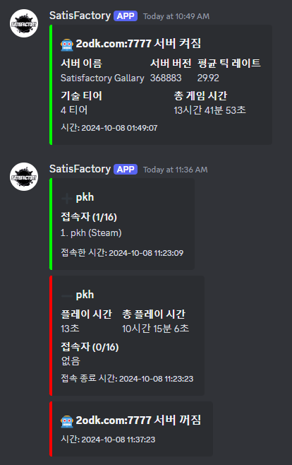

# Satisfactory Discord Bot

이 프로젝트는 Satisfactory 게임 서버의 상태를 모니터링하고 Discord 채널에 정보를 제공하는 봇입니다.

## 기능

- 서버의 운영 시간(uptime) 확인
- 서버 플레이 타임 랭킹 확인
- 서버 상태 변경 시 Discord 알림

  

## 설치

1. **리포지토리 클론**

   ```bash
   git clone https://github.com/pkhkr/satisfactory-discord-bot.git
   cd satisfactory-discord-bot
   ```

2. **Discord 개발자 포털 설정**

   a. [Discord 개발자 포털](https://discord.com/developers/applications)에서 새 애플리케이션을 생성합니다.
   b. "Bot" 섹션에서 봇을 생성하고 토큰을 복사합니다. 이 토큰을 `DISCORD_TOKEN` 환경 변수에 설정합니다.
   c. "Bot" 섹션에서 "Privileged Gateway Intents" 아래의 "Message Content Intent"를 활성화합니다.

3. **Satisfactory 서버 설정**

   a. Satisfactory 서버의 `GameUserSettings.ini` 파일을 찾습니다. 일반적으로 `FactoryGame/Saved/Config/WindowsServer/` 경로에 있습니다.
   b. 파일을 열고 `LogNet` 로그 레벨이 `Log`보다 낮은지 확인합니다. 낮지 않다면 다음과 같이 수정합니다:

      ```ini
      [Core.Log]
      LogNet=Log
      ```

   c. 서버를 재시작하여 변경사항을 적용합니다.

   지원되는 로그 레벨 값은 다음과 같습니다 (가장 상세한 것부터 순서대로):
   - VeryVerbose
   - Verbose
   - Log
   - Display
   - Warning
   - Error
   - Fatal

   일반적으로 'Log' 레벨이 권장됩니다. 더 자세한 정보가 필요한 경우 'Verbose'나 'VeryVerbose'를 사용할 수 있지만, 로그 파일의 크기가 빠르게 증가할 수 있습니다.

4. **환경 설정**

   `docker-compose.yml` 파일에서 환경 변수를 설정합니다. 다음과 같은 형식으로 설정할 수 있습니다:

   ```yaml
   version: '3'

   services:
     satisfactory-bot:
       build: .
       environment:
         - DISCORD_TOKEN=your_discord_token
         - SERVER_ADDRESS=your_server_address
         - SERVER_PORT=your_server_port
         - LOG_PATH=/app/logs/FactoryGame.log
         - DISCORD_CHANNEL_ID=your_discord_channel_id
         - MAX_PLAYERS=maximum_number_of_players
         - ADMIN_PASSWORD=satisfactory server admin password
       volumes:
         - my_satisfactory_server/config/gamefiles/FactoryGame/Saved/Logs:/app/logs:ro
   ```

   각 환경 변수에 대한 설명:
   - DISCORD_TOKEN: Discord 봇 토큰
   - SERVER_ADDRESS: Satisfactory 서버 주소
   - SERVER_PORT: Satisfactory 서버 포트
   - LOG_PATH: 로그 파일 경로 (컨테이너 내부 경로) / 변경하지 않는 것이 좋습니다
   - DISCORD_CHANNEL_ID: 봇이 메시지를 보낼 Discord 채널 ID
   - MAX_PLAYERS: 서버의 최대 플레이어 수
   - ADMIN_PASSWORD: Satisfactory 서버 관리자 비밀번호

   volumes 설정에서 'my_satisfactory_server/config/gamefiles/FactoryGame/Saved/Logs'를 실제 운영 중인 서버의 로그 폴더 경로로 변경해야 합니다. 예를 들어:

   ```yaml
   volumes:
     - /path/to/your/satisfactory/server/FactoryGame/Saved/Logs:/app/logs:ro
   ```

   여기서 '/path/to/your/satisfactory/server/'는 실제 Satisfactory 서버가 설치된 경로로 대체해야 합니다.

5. **도커(Docker) 사용**

   도커를 사용하여 봇을 실행할 수 있습니다. `docker-compose.yml` 파일을 사용하여 컨테이너를 빌드하고 실행합니다.

   ```bash
   docker-compose up --build -d
   ```

## 사용법

- Discord에서 `!uptime` 명령어를 사용하여 서버의 운영 시간을 확인할 수 있습니다.
- `!ranking` 명령어를 사용하여 서버의 플레이 타임 랭킹을 확인할 수 있습니다.

  

## 코드 구조

- `satisfactory/log_tracer.py`: 로그 파일을 처리하고 서버 상태를 추적하는 클래스가 포함되어 있습니다.
- `satisfactory/cogs/uptime.py`: 서버의 운영 시간을 확인하는 Discord 명령어가 정의되어 있습니다.
- `satisfactory/cogs/ranking.py`: 서버의 플레이 타임 랭킹을 확인하는 Discord 명령어가 정의되어 있습니다.
- `satisfactory/database.py`: 서버와 플레이어 정보를 저장하고 불러오는 데이터베이스 관련 함수가 포함되어 있습니다.

## TODO

- 콘솔 채널 연동: 서버의 콘솔 출력을 Discord 채널로 실시간 전송하는 기능 구현
- 채팅 연동: 게임 내 채팅과 Discord 채널 간의 양방향 통신 기능 추가
- 서버 상태 모니터링: 서버의 CPU, 메모리 사용량 등을 주기적으로 확인하고 보고하는 기능 개발

## 기여

기여를 원하신다면, 이 리포지토리를 포크하고 풀 리퀘스트를 보내주세요.
